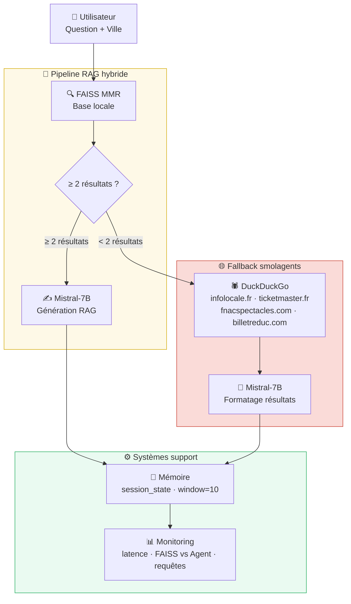

# 🎉 Puls-Events — Système RAG Hybride (POC → MVP) <br>

Assistant intelligent de recommandation d'événements culturels français.  
Architecture **RAG + Agent Web** combinant **FAISS**, **LangChain**, **Mistral-7B** et **smolagents (Hugging Face)**.

> 🚀 **Projet 13** — Passage d'un POC local à un MVP scalable  <br>
> 📍 **Entreprise** : Puls-Events <br>
---

## 🆕 Évolution : POC → MVP <br>
```
| Fonctionnalité    | POC (v1)               | MVP (v2)                                   |
|-------------------|------------------------|--------------------------------------------|
| Interface         | Bouton "Chercher"      | Chat multi-tours (ChatGPT-like)            |
| Mémoire           | Aucune                 | Conversationnelle (10 derniers échanges)   |
| Géographie        | Paris en dur           | 40 villes + géolocalisation IP automatique |
| Données           | FAISS local uniquement | FAISS + fallback smolagents                |
|                   |                        |(web temp réel )                            |
| Sources web       | Aucune                 | Sites ciblés                               |
|                   |                        |(infolocale, ticketmaster ,fnac...)         |
| Fenêtre temporelle| 12 mois passés         | -12 mois / +12 mois                        |
| Monitoring        | Aucun                  | Dashboard latence, FAISS vs Agent          |
| Déploiement       | Local uniquement       | Prêt pour GCP / Azure / AWS                |
``` 
---

## 📋 Description <br>

Ce projet est développé pour **Puls-Events**, une plateforme de découverte d'événements culturels en France.<br>

Le système MVP :<br>
- Collecte les événements via l'API Open Agenda
- Indexe les embeddings dans une base **FAISS** (Flat L2, 1 774 vecteurs)
- Génère des réponses naturelles via **Mistral-7B**
- Bascule automatiquement vers **smolagents** (Hugging Face) si FAISS < 2 résultats
- Recherche sur des **sites d'événements fiables** (infolocale.fr, ticketmaster.fr, etc.)
- Retient l'**historique conversationnel** (10 derniers échanges)
- Détecte la **ville automatiquement** via l'adresse IP
- Monitore les **performances** en temps réel

---

## 🗂️ Structure du projet <br>

```
puls-events-mvp/
│
├── .env                        ← Clés API 
├── .gitignore
├── requirements.txt
├── README.md
│
├── scripts/
│   ├── fetch_events.py         ← Collecte API Open Agenda
│   ├── build_vector_db.py      ← Chunking + Embedding + Index FAISS
│   ├── chatbot.py              ← Interface terminal
│   ├── app.py                  ← Interface MVP Streamlit (chat + mémoire + géo)
│   ├── agent_search.py         ← Module smolagents (fallback web temps réel)
│   └── test_events.py          ← 7 tests unitaires pytest
│
└── data/                       ← Généré automatiquement (non versionné)
    ├── events_clean.csv
    └── index/
        └── faiss_index/
            ├── index.faiss
            └── index.pkl
```

---

## ⚙️ Installation <br>

### 1. Cloner le projet <br>

```bash
git clone https://github.com/Cheikhafef/puls-events-mvp.git
cd puls-events-mvp
```

### 2. Créer l'environnement virtuel <br>

```bash
python -m venv venv

# Windows
venv\Scripts\activate

# macOS / Linux
source venv/bin/activate
```

### 3. Installer les dépendances <br>

```bash
pip install -r requirements.txt
```

### 4. Configurer les clés API <br>

Créez un fichier `.env` à la racine :

```
MISTRAL_API_KEY=**********************
OPENAGENDA_API_KEY=**********************
```

> 💡 Clé Mistral : [console.mistral.ai](https://console.mistral.ai)

---

## 🚀 Utilisation <br>

### Étape 1 — Collecter les événements <br>

```bash
python scripts/fetch_events.py
```

```
Periode : [aujourd'hui - 12 mois] --> [aujourd'hui + 12 mois]
Total evenements bruts : 5368
Evenements valides : 360
Dataset sauvegarde : data/events_clean.csv
```

### Étape 2 — Construire la base FAISS <br>

```bash
python scripts/build_vector_db.py
```

```
Evenements charges : 360
Chunks crees : 1774
Index FAISS : 1774 vecteurs indexés
```

### Étape 3 — Lancer le MVP Streamlit <br>

```bash
streamlit run scripts/app.py
```

Ouvre sur [http://localhost:8501](http://localhost:8501)

---

## 🏗️ Architecture MVP <br>




---

## 🔧 Stack technique

| Composant       | POC                | MVP                                    |
|-----------------|--------------------|----------------------------------------|
| Langage         | Python 3.11        | Python 3.11                            |
| Interface       | Streamlit (bouton) | Streamlit (chat multi-tours)           |
| Embedding       | all-MiniLM-L6-v2   | all-MiniLM-L6-v2                       |
| Base vectorielle| FAISS Flat L2      | FAISS + fallback smolagents            |
| LLM             | Mistral-7B via API | Mistral-7B via API                     |
| Orchestration   | LangChain          | LangChain v0.3+                        |
| Agent web       | Aucun              | smolagents (Hugging Face)              |
| Recherche web   | Aucune             | DuckDuckGoSearchTool (sites ciblés)    |
| Mémoire         | Aucune             | session_state (window=10)              |
| Géolocalisation | Paris en dur       | ip-api.com + menu 40 villes            |
| Monitoring      | Aucun              | Dashboard Streamlit (latence, sources) |
| Tests           | pytest (7 tests)   | pytest (7 tests)                       |

---

## 📊 Résultats <br>

| Métrique                 | Valeur               |
|--------------------------|----------------------|
| Événements collectés     | 360                  |
| Vecteurs FAISS indexés   | 1 774                |
| Temps de recherche FAISS | < 1s                 |
| Temps de recherche web   | 5-20s                |
| Tests unitaires          | 7/7 ✅              |
| Villes couvertes         | 40 villes françaises |
| Fenêtre temporelle       | -12 mois / +12 mois  |

---

## ✅ Tests unitaires <br>

```bash
python -m pytest scripts/test_events.py -v
```

| Test                          | Description                                   |
|-------------------------------|-----------------------------------------------|
| `test_colonnes_presentes`     | 7 colonnes attendues présentes                |
| `test_pas_de_nan`             | Aucun NaN dans title, description, start_date |
| `test_dates_periode_valide`   | Dates dans la fenêtre valide                  |
| `test_perimetre_paris`        | CP 75xxx ou city = Paris                      |
| `test_pas_de_doublons`        | Aucun doublon sur (title, start_date)         |
| `test_index_faiss_non_vide`   | Index FAISS > 100 vecteurs                    |
| `test_chunks_faiss_coherents` | >50% chunks avec date et localisation         |

---

## 🔭 Prochaines étapes (Sprint 3) <br>

- [ ] Migration FAISS → **Qdrant** (base vectorielle managée, port 6333)
- [ ] Remplacement Streamlit → **Chainlit** (interface ChatGPT-like native)
- [ ] Déploiement **GCP Cloud Run** (Docker + CI/CD GitHub Actions)
- [ ] Migration vers **Google Custom Search API** (meilleure couverture géographique)
- [ ] Persistance historique avec **Redis** (Cloud Memorystore)


