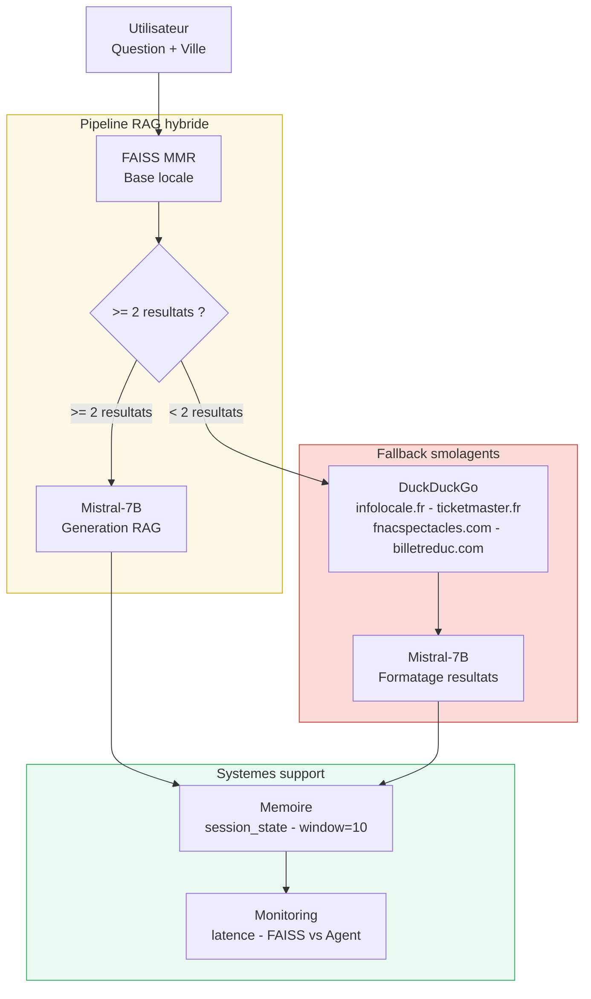

# Puls-Events — Systeme RAG Hybride (POC vers MVP)

Assistant intelligent de recommandation d'evenements culturels francais.
Architecture **RAG + Agent Web** combinant **FAISS**, **LangChain**, **Mistral-7B** et **smolagents (Hugging Face)**.

> Projet realise dans le cadre d'une formation Data Engineer en alternance — Puls-Events

---

## Evolution : POC vers MVP

| Fonctionnalite     | POC (v1)               | MVP (v2)                                   |
|--------------------|------------------------|--------------------------------------------|
| Interface          | Bouton "Chercher"      | Chat multi-tours (ChatGPT-like)            |
| Memoire            | Aucune                 | Conversationnelle (10 derniers echanges)   |
| Geographie         | Paris en dur           | 40 villes + geolocalisation IP automatique |
| Donnees            | FAISS local uniquement | FAISS + fallback smolagents (web temps     |
|                    |                        |reel)                                      | 
| Sources web        | Aucune                 | Sites cibles (infolocale, ticketmaster,    |
|                    |                        |fnac...)                                    |
| Fenetre temporelle | 12 mois passes         | -12 mois / +12 mois                        |
| Monitoring         | Aucun                  | Dashboard latence, FAISS vs Agent          |
| Deploiement        | Local uniquement       | Pret pour GCP / Azure / AWS                |

---

## Description

Ce projet est developpe pour **Puls-Events**, une plateforme de decouverte d'evenements culturels en France.

Le systeme MVP :
- Collecte les evenements via l'API Open Agenda
- Indexe les embeddings dans une base **FAISS** (Flat L2, 1 774 vecteurs)
- Genere des reponses naturelles via **Mistral-7B**
- Bascule automatiquement vers **smolagents** (Hugging Face) si FAISS < 2 resultats
- Recherche sur des **sites d'evenements fiables** (infolocale.fr, ticketmaster.fr, etc.)
- Retient l'**historique conversationnel** (10 derniers echanges)
- Detecte la **ville automatiquement** via l'adresse IP
- Monitore les **performances** en temps reel

---

## Structure du projet

```
puls-events-mvp/
|
|-- .env                        <- Cles API (ne jamais versionner !)
|-- .gitignore
|-- requirements.txt
|-- README.md
|
|-- scripts/
|   |-- fetch_events.py         <- Collecte API Open Agenda
|   |-- build_vector_db.py      <- Chunking + Embedding + Index FAISS
|   |-- chatbot.py              <- Interface terminal
|   |-- app.py                  <- Interface MVP Streamlit (chat + memoire + geo)
|   |-- agent_search.py         <- Module smolagents (fallback web temps reel)
|   `-- test_events.py          <- 7 tests unitaires pytest
|
`-- data/                       <- Genere automatiquement (non versionne)
    |-- events_clean.csv
    `-- index/
        `-- faiss_index/
            |-- index.faiss
            `-- index.pkl
```

---

## Installation

### 1. Cloner le projet

```bash
git clone https://github.com/Cheikhafef/puls-events-mvp.git
cd puls-events-mvp
```

### 2. Creer l'environnement virtuel

```bash
python -m venv venv

# Windows
venv\Scripts\activate

# macOS / Linux
source venv/bin/activate
```

### 3. Installer les dependances

```bash
pip install -r requirements.txt
```

### 4. Configurer les cles API

Creez un fichier `.env` a la racine :

```
MISTRAL_API_KEY=**********************
OPENAGENDA_API_KEY=**********************
MISTRAL_MODEL=open-mistral-7b
MISTRAL_TEMPERATURE=0.1
```

---

## Utilisation

### Etape 1 — Collecter les evenements

```bash
python scripts/fetch_events.py
```

```
Periode : [aujourd'hui - 12 mois] --> [aujourd'hui + 12 mois]
Total evenements bruts : 5368
Evenements valides : 360
Dataset sauvegarde : data/events_clean.csv
```

### Etape 2 — Construire la base FAISS

```bash
python scripts/build_vector_db.py
```

```
Evenements charges : 360
Chunks crees : 1774
Index FAISS : 1774 vecteurs indexes
```

### Etape 3 — Lancer le MVP Streamlit

```bash
streamlit run scripts/app.py
```

Ouvre sur [http://localhost:8501](http://localhost:8501)

---

## Architecture MVP



---

## Stack technique

| Composant | POC | MVP |
|---|---|---|
| Langage | Python 3.11 | Python 3.11 |
| Interface | Streamlit (bouton) | Streamlit (chat multi-tours) |
| Embedding | all-MiniLM-L6-v2 | all-MiniLM-L6-v2 |
| Base vectorielle | FAISS Flat L2 | FAISS + fallback smolagents |
| LLM | Mistral-7B via API | Mistral-7B via API |
| Orchestration | LangChain | LangChain v0.3+ |
| Agent web | Aucun | smolagents (Hugging Face) |
| Recherche web | Aucune | DuckDuckGoSearchTool (sites cibles) |
| Memoire | Aucune | session_state (window=10) |
| Geolocalisation | Paris en dur | ip-api.com + menu 40 villes |
| Monitoring | Aucun | Dashboard Streamlit (latence, sources) |
| Tests | pytest (7 tests) | pytest (7 tests) |

---

## Resultats

| Metrique | Valeur |
|---|---|
| Evenements collectes | 360 |
| Vecteurs FAISS indexes | 1 774 |
| Temps de recherche FAISS | < 1s |
| Temps de recherche web | 5-20s |
| Tests unitaires | 7/7 passes |
| Villes couvertes | 40 villes francaises |
| Fenetre temporelle | -12 mois / +12 mois |

---

## Tests unitaires

```bash
python -m pytest scripts/test_events.py -v
```

| Test | Description |
|---|---|
| `test_colonnes_presentes` | 7 colonnes attendues presentes |
| `test_pas_de_nan` | Aucun NaN dans title, description, start_date |
| `test_dates_periode_valide` | Dates dans la fenetre valide (-12/+12 mois) |
| `test_perimetre_paris` | CP 75xxx ou city = Paris |
| `test_pas_de_doublons` | Aucun doublon sur (title, start_date) |
| `test_index_faiss_non_vide` | Index FAISS > 100 vecteurs |
| `test_chunks_faiss_coherents` | >50% chunks avec date et localisation |

---

## Prochaines etapes (Sprint 3)

- [ ] Migration FAISS vers **Qdrant** (base vectorielle managee, port 6333)
- [ ] Remplacement Streamlit vers **Chainlit** (interface ChatGPT-like native)
- [ ] Deploiement **GCP Cloud Run** (Docker + CI/CD GitHub Actions)
- [ ] Migration vers **Google Custom Search API**
- [ ] Persistance historique avec **Redis** (Cloud Memorystore)

---


