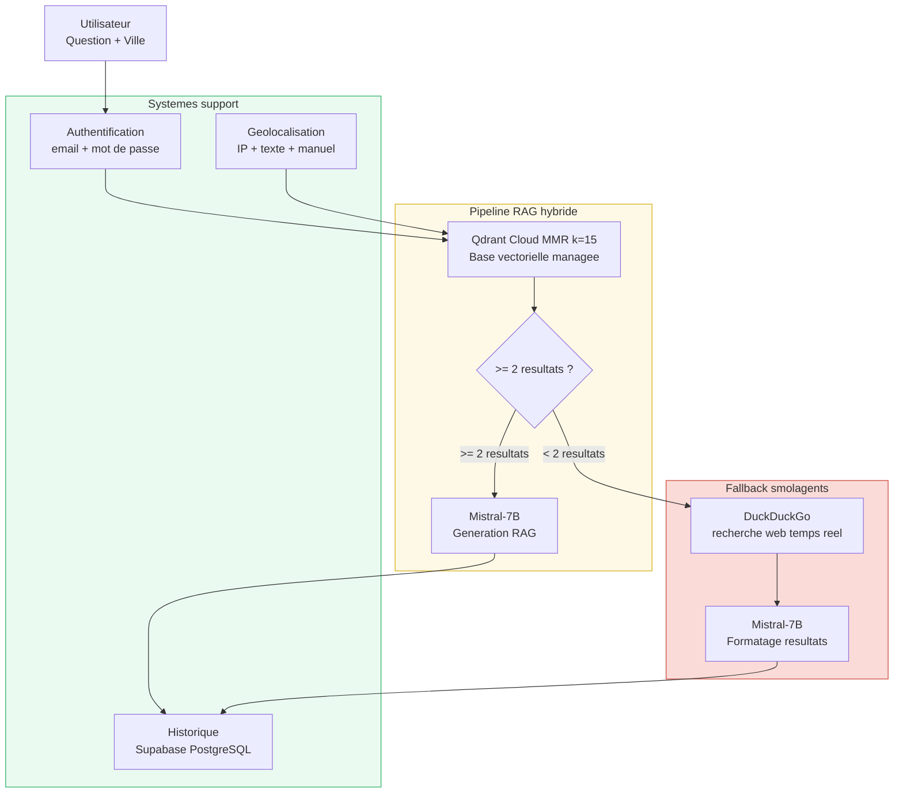

# Puls-Events — Chatbot RAG Hybride (MVP en production) <br>

Assistant intelligent de recommandation d'evenements culturels francais.
Architecture **RAG hybride + Agent Web** combinant **Qdrant Cloud**, **Chainlit**, **Mistral-7B** et **smolagents (Hugging Face)**, deployee sur **Azure Container Apps**.

> Projet realise dans le cadre d'une formation Data Engineer  — Puls-Events (Projet 13)

**URL production :** https://puls-events-app.purplepebble-68cea5a4.francecentral.azurecontainerapps.io/

---

## Evolution : POC vers MVP <br>

| Fonctionnalite | POC (v1) | MVP (v2 — production) |
|---|---|---|
| Interface | Streamlit (bouton) | Chainlit (chat multi-tours, auth, historique) |
| Base vectorielle | FAISS local | Qdrant Cloud (1786 vecteurs, dim=384) |
| Memoire | Aucune | Conversationnelle persistante (Supabase PostgreSQL) |
| Geographie | Paris en dur | 37 villes + detection GeoIP hybride |
| Authentification | Aucune | Email + mot de passe, multi-utilisateurs |
| Sources web | Aucune | smolagents + DuckDuckGo (fallback si < 2 resultats) |
| Fenetre temporelle | 12 mois passes | 2025, 2026, 2027 (filtres stricts mois + annee + saisons) |
| Deploiement | Local uniquement | Azure Container Apps (Docker, HTTPS natif, auto-scaling) |
| Personnalisation UI | Aucune | Theme custom (CSS), branding Chainlit retire |

---

## Description <br>

Ce projet est developpe pour **Puls-Events**, une plateforme de decouverte d'evenements culturels en France.

Le systeme MVP :
- Collecte les evenements via l'API Open Agenda
- Indexe les embeddings dans **Qdrant Cloud** (HuggingFace MiniLM-L6-v2, dim=384, 1786 vecteurs)
- Genere des reponses naturelles via **Mistral-7B** (open-mistral-7b)
- Bascule automatiquement vers **smolagents** (DuckDuckGo) si Qdrant retourne moins de 2 resultats
- Pour les villes hors Paris : bascule **directement** vers la recherche web (Qdrant ne couvre que Paris)
- Retient l'**historique conversationnel complet** via Supabase PostgreSQL (5 tables)
- Detecte la **ville automatiquement** via GeoIP (ipapi.co) + detection dans le texte
- Applique des **filtres temporels stricts** : mois + annee, saisons, demain, hier, ce week-end
- Gere l'**authentification multi-utilisateurs** (email + mot de passe)
- Est deploye en **production** sur Azure Container Apps avec HTTPS natif

---

## Structure du projet <br>

```
puls-events-mvp/
|
|-- .env                        <- Cles API et secrets (ne jamais versionner !)
|-- .dockerignore
|-- .gitignore
|-- Dockerfile
|-- requirements.txt
|-- README.md
|
|-- chatbot_chainlit.py         <- Application principale (interface, auth, RAG, historique)
|-- agent_search.py             <- Module fallback web (smolagents + DuckDuckGo)
|-- .chainlit/
|   `-- config.toml             <- Configuration Chainlit (UI, theme, features)
|
`-- public/
    `-- custom.css              <- Theme personnalise (couleurs, branding)
```

---

## Installation <br>

### 1. Cloner le projet <br>

```bash
git clone https://github.com/Cheikhafef/MVP-Puls-Events.git
cd MVP-Puls-Events
```

### 2. Creer l'environnement virtuel <br>

```bash
python -m venv venv

# Windows
venv\Scripts\activate

# macOS / Linux
source venv/bin/activate
```

### 3. Installer les dependances <br>

```bash
pip install -r requirements.txt
```

### 4. Configurer les cles API <br>

Creez un fichier `.env` a la racine :

```
MISTRAL_API_KEY=**********************
OPENAGENDA_API_KEY=**********************
QDRANT_URL=**********************
QDRANT_API_KEY=**********************
SUPABASE_URL=**********************
SUPABASE_KEY=**********************
DATABASE_URL=**********************
MISTRAL_MODEL=open-mistral-7b
MISTRAL_TEMPERATURE=0.1
CHAINLIT_AUTH_SECRET=**********************
```

---

## Utilisation <br>

### Lancer l'application en local <br>

```bash
chainlit run chatbot_chainlit.py -w
```

Ouvre sur [http://localhost:8000](http://localhost:8000)

### Deploiement Azure Container Apps <br>

```bash
docker build --no-cache -t pulseventsregistry.azurecr.io/puls-events:latest .
az acr login --name pulseventsregistry
docker push pulseventsregistry.azurecr.io/puls-events:latest
az containerapp update --name puls-events-app --resource-group puls-events-rg --revision-suffix vNN
az containerapp ingress traffic set --name puls-events-app --resource-group puls-events-rg --revision-weight puls-events-app--vNN=100
```

---

## Architecture MVP <br>


```mermaid
flowchart TD
    USR["Utilisateur\nQuestion + Ville"]

    subgraph RAG["Pipeline RAG hybride"]
        direction TB
        QDRANT["Qdrant Cloud MMR k=15\nBase vectorielle managee"]
        COND{">= 2 resultats ?"}
        MISTRAL["Mistral-7B\nGeneration RAG"]
    end

    subgraph AGENT["Fallback smolagents"]
        direction TB
        DDG["DuckDuckGo\nrecherche web temps reel"]
        FORMAT["Mistral-7B\nFormatage resultats"]
    end

    subgraph SUPPORT["Systemes support"]
        direction LR
        AUTH["Authentification\nemail + mot de passe"]
        MEM["Historique\nSupabase PostgreSQL"]
        GEO["Geolocalisation\nIP + texte + manuel"]
    end

    USR --> AUTH
    AUTH --> QDRANT
    QDRANT --> COND
    COND -->|">= 2 resultats"| MISTRAL
    COND -->|"< 2 resultats"| DDG
    DDG --> FORMAT
    MISTRAL --> MEM
    FORMAT --> MEM
    GEO --> QDRANT

    style RAG fill:#FEF9E7,stroke:#D4AC0D
    style AGENT fill:#FADBD8,stroke:#CB4335
    style SUPPORT fill:#EAFAF1,stroke:#27AE60
```

---

## Stack technique <br>

| Composant | Technologie | Detail |
|---|---|---|
| Langage | Python | 3.11-slim (container) |
| Interface | Chainlit | v2.11.1 |
| Base vectorielle | Qdrant Cloud | 1786 vecteurs, dim=384 |
| Embedding | HuggingFace MiniLM-L6-v2 | Calcul dans le container |
| LLM | Mistral AI API | open-mistral-7b |
| Persistance | Supabase PostgreSQL | 5 tables, 500 MB free tier |
| Recherche web | smolagents + DuckDuckGo | Fallback si < 2 resultats Qdrant |
| Authentification | Chainlit Auth | Email + mot de passe |
| Deploiement | Docker + Azure Container Apps | Auto-scaling 1-10 replicas, HTTPS natif |
| Registry | Azure Container Registry | Stockage images Docker |
| Theme UI | CSS custom | Branding Chainlit retire |

---

## Resultats <br>

| Metrique | Valeur |
|---|---|
| Villes couvertes | 37 villes francaises |
| Fenetre temporelle | 2025, 2026, 2027 |
| Vecteurs Qdrant indexes | 1 786 |
| Temps de reponse Qdrant | < 2s (temps moyen) |
| Revisions deployees | 107 (v1 a v107) |
| Filtres temporels | Mois + annee, saisons, demain, hier, ce week-end |

---

## Filtres temporels supportes <br>

| Expression | Exemple | Comportement |
|---|---|---|
| Mois + annee | "concerts en aout 2026" | Filtre strict : seulement aout 2026 |
| Annee seule | "evenements 2027" | Toute l'annee 2027 |
| Saisons | "cet ete", "cet hiver" | Plage saisonniere stricte |
| Relatif | "demain", "hier", "ce week-end" | Date exacte calculee |
| Jour precis | "le 29 juillet 2026" | Jour exact uniquement |

---

## Securite <br>

- Authentification email + mot de passe, sessions Chainlit
- HTTPS natif (certificat SSL gere par Azure)
- Secrets isoles via `.env`, jamais versionnes
- Historique des conversations filtre par `user_id` (cle etrangere)

**A ameliorer :** <br>
- Migration des credentials vers Azure Key Vault
- Mise en place d'un rate limiting
- CI/CD automatise (actuellement deploiement manuel)
- Formalisation de la politique de retention RGPD

---

## Prochaines etapes (nice-to-have) <br>

- [ ] Application mobile React Native (GPS natif disponible)
- [ ] Interface d'administration utilisateurs
- [ ] Recommandations personnalisees basees sur l'historique
- [ ] Filtres temporels relatifs avances ("semaine prochaine", "mois prochain")
- [ ] Enrichissement Qdrant multi-villes (actuellement Paris uniquement)
- [ ] CI/CD automatise via GitHub Actions
- [ ] Migration des secrets vers Azure Key Vault

---

## Auteure

**Afef Cheikh** — Formation Data Engineer
GitHub : [Cheikhafef](https://github.com/Cheikhafef) · Email : cheikhafef@gmail.com

(https://github.com/Cheikhafef/MVP-Puls-Events)